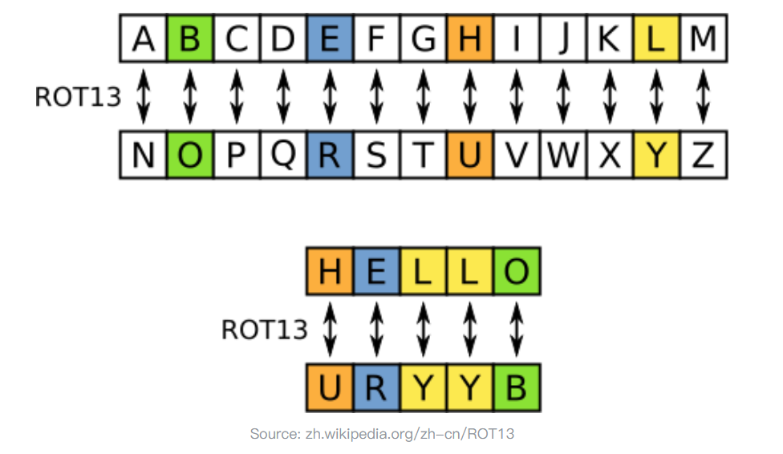

# ROT5介绍
只对数字进行编码，用当前数字往前数的第5个数字替换当前数字，例如当前为0，编码后变成5，当前为1，编码后变成6，以此类推顺序循环

    0 1 2 3 4
    5 6 7 8 9
# ROT13介绍
只对字母进行编码，用当前字母往前数的第13个字母替换当前字母，例如当前为A，编码后变成N，当前为B，编码后变成O，以此类推顺序循环

# ROT18介绍
这是一个异类，本来没有，它是将ROT5和ROT13组合在一起，为了好称呼，将其命名为ROT18
# ROT47介绍
对数字、字母、常用符号进行编码，按照它们的ASCII值进行位置替换，用当前字符ASCII值往前数的第47位对应字符替换当前字符，例如当前为小写字母z，编码后变成大写字母K，当前为数字0，编码后变成符号_。用于ROT47编码的字符其ASCII值范围是33－126。
加密：密文=明文-47
解密：明文=密文+47
